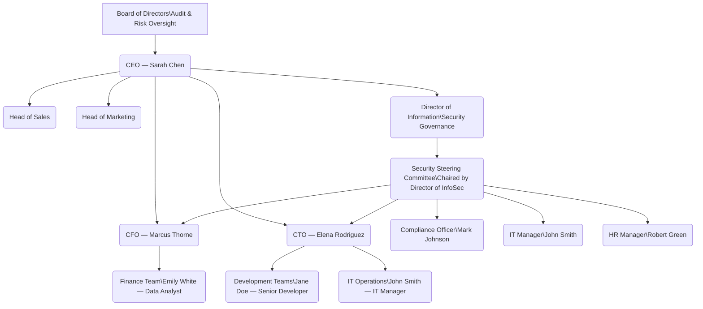

# ICDFA GRC 102 Information Security Governance
# Student Name: DAVID SAMSON GYELPANYI
# Instructor: MR. AMINU IDRIS

# Interactive Lab GRC102 Week 5 Submission
**Course:** GRC102 Information Security Governance
**Lab:** Lab 5 Information Security Governance in Action
**Role:** Director of Information Security Governance, GlobalHealth Connect
**Submission Date:** March 7, 2026

---

# Table of Contents

1. [Task 1 : The Governance Blueprint](#task-1)
   - 1.1 Proposed Security Governance Organizational Chart
   - 1.2 RACI Matrix
2. [Task 2 : The Security Charter](#task-2)
   - 2.1 GHC Information Security Charter
   - 2.2 Justification Memo to Marcus Thorne (CFO)
3. [Task 3 : Board Reporting and Metrics](#task-3)
   - 3.1 Board Executive Summary
   - 3.2 Rationale for Metric Selection
4. [Task 4 : The Security Steering Committee](#task-4)
   - 4.1 SSC Terms of Reference
   - 4.2 Sample SSC Meeting Agenda
   - 4.3 Briefing Note to Sarah Chen (CEO)
5. [Task 5 : Governance Maturity Assessment](#task-5)
   - 5.1 Completed Maturity Assessment Table
   - 5.2 Maturity Roadmap
   - 5.3 Executive Summary of Assessment for David Miller (Board)

---

# Task 1 : The Governance Blueprint

## Deliverable 1.1 : Proposed Security Governance Organizational Chart

The newly established structure designates the Director of Information Security Governance as a senior executive position who reports directly to the CEO. The function's strategic value requires this organizational structure because it needs to maintain operational autonomy from both technology and finance departments. The Security Steering Committee (SSC) functions as a cross-functional advisory body which makes decisions under the leadership of the Director of InfoSec Governance and includes representatives from all major business units.

**Rationale for Structure:**

The Director of Information Security Governance has direct reporting responsibilities to the CEO because executive sponsorship and organizational authority must be established for the security program. The function needs to be placed outside the CTO's control because it creates a conflict of interest. The SSC creates a shared governance body that includes the CTO, CFO, IT, HR, and Compliance departments to make security decisions through collaborative processes instead of unilateral decision-making. The Board maintains its responsibility for audit and risk oversight because it must fulfill its obligations to both shareholders and regulators.

---

## Deliverable 1.2 — RACI Matrix

**Key Governance Activities Assessed:**
- **Activity A:** Information Security Policy Approval
- **Activity B:** Organizational Risk Assessment Review
- **Activity C:** Security Incident Response Planning

| Stakeholder | Activity A: Policy Approval | Activity B: Risk Assessment Review | Activity C: Incident Response Planning |
|---|---|---|---|
| **CEO (Sarah Chen)** | A | I | I |
| **CFO (Marcus Thorne)** | C | C | I |
| **CTO (Elena Rodriguez)** | C | C | C |
| **Director of InfoSec Governance** | R | R / A | R / A |
| **IT Manager (John Smith)** | C | R | R |
| **Compliance Officer (Mark Johnson)** | C | C | C |
| **HR Manager (Robert Green)** | I | I | C |
| **Senior Developer (Jane Doe)** | I | I | I |
| **Board of Directors** | I | A | I |

**Key:**
- **R — Responsible:** Does the work
- **A — Accountable:** Final authority; single owner per activity
- **C — Consulted:** Provides input before a decision is made
- **I — Informed:** Notified of outcomes; no action required

**Notes:**

The CEO serves as the signed authority for Policy Approval while the Director of InfoSec Governance manages document creation and policy coordination work. The CFO and CTO are consulted to ensure policies do not conflict with financial or operational constraints. The Director of InfoSec Governance handles all responsibilities for Risk Assessment Review which includes reporting major discoveries to the Board. The IT Manager handles technical response procedures for Incident Response Planning while the Director of InfoSec Governance controls the complete response strategy. HR serves as a resource because it handles insider threat situations and employee notification requirements.

---

# Task 2 : The Security Charter

## Deliverable 2.1 : GHC Information Security Charter

---

# GlobalHealth Connect Information Security Charter

**Document Classification:** Governance — Internal
**Version:** 1.0
**Effective Date:** March 7, 2026
**Approved By:** Sarah Chen, CEO, GlobalHealth Connect

---

## 1. Purpose

GlobalHealth Connect (GHC) operates at the intersection of healthcare delivery and digital technology, managing Protected Health Information (PHI) on behalf of over 500 clinics and healthcare providers across the United States and internationally. The trust placed in GHC by its clients, patients, and partners is the foundation of its business.

The Information Security Charter establishes the GHC Information Security Program through which it develops its operational framework and administrative authority and essential operational procedures. The executive directive which this Charter establishes enables the organization to create, operationalize, sustain, and enforce a risk-based information security governance framework throughout its complete operational structure. The framework establishes information security as a strategic business function that supports GHC's objectives for market expansion, regulatory adherence, customer confidence, and operational efficiency.

---

## 2. Scope

This Charter and the Information Security Program it establishes apply to:

- **All information assets** owned, processed, stored, or transmitted by GHC, including PHI, financial data, intellectual property, and operational data.
- **All GHC systems and infrastructure**, including cloud platforms, on-premise systems, corporate endpoints, and development environments.
- **All personnel**, including full-time employees, contractors, consultants, and third-party vendors with access to GHC systems or data.
- **All entities acquired by GHC**, including the two recently integrated startups, regardless of their legacy security posture.
- **All geographic locations** in which GHC operates or processes data, inclusive of jurisdictions subject to HIPAA, HITECH, GDPR, and applicable state-level health data regulations.

**Policy Framework Coverage:**

The Information Security Program will establish and maintain a structured, layered policy framework consisting of Policies, Standards, Guidelines, and Procedures — which will establish separate governance methods through their individual functions. At least the following policy domains need to be created, ratified, and sustained according to the requirements of this Charter:

| Policy Domain | Purpose |
|---|---|
| **Enterprise Security Policy** | High-level statement of GHC's overall approach to information security. |
| **Acceptable Use Policy** | Defines appropriate use of GHC IT resources and prohibited activities for all staff. |
| **Access Control Policy** | Establishes rules for granting, reviewing, and revoking access to systems and PHI. |
| **Data Classification Policy** | Defines categories of data sensitivity (including PHI) and corresponding handling requirements. |
| **Cloud Security Policy** | Sets requirements for the secure use of cloud services and storage — critical given GHC's cloud-first platform. |
| **Incident Response Policy** | Outlines procedures for detecting, reporting, and responding to security incidents, including HIPAA breach notification timelines. |
| **Mobile Device Policy** | Addresses security requirements for mobile devices accessing GHC systems and data. |
| **Physical Security Policy** | Defines controls for securing GHC's physical assets, facilities, and equipment. |

---

## 3. Authority

The Information Security Program is established under the direct authority of the Chief Executive Officer, Sarah Chen, with oversight provided by the GHC Board of Directors. The **Director of Information Security Governance** is hereby granted the following authority:

- To develop, publish, and enforce information security policies, standards, and procedures across all GHC departments.
- To conduct or commission risk assessments, audits, and security reviews of any GHC system, process, or third-party relationship.
- To escalate unresolved security risks or non-compliance matters directly to the CEO and, where appropriate, the Board of Directors.
- To chair the Security Steering Committee (SSC) and drive cross-functional alignment on security decisions.
- To engage external specialists, auditors, or legal counsel as required to fulfil the Program's mandate.

No department or individual may override or circumvent the requirements of the Information Security Program without documented, risk-accepted approval from the Director of Information Security Governance and the CEO.

---

## 4. Roles and Responsibilities

The governance structure for information security at GHC is defined in detail in the Security Governance Organizational Chart and RACI Matrix (Task 1). The following high-level responsibilities apply:

| Role | Responsibility |
|---|---|
| **Board of Directors** | Provides audit and risk oversight; receives quarterly security updates; approves risk appetite. |
| **CEO** | Sponsors the Program; approves this Charter; resolves executive-level escalations. |
| **CFO** | Approves security budgets; ensures financial risk from security threats is understood and managed. |
| **CTO** | Ensures security requirements are integrated into technology development and operations. |
| **Director of InfoSec Governance** | Owns and operates the Program; sets strategy; chairs the SSC; reports to the CEO and Board. |
| **IT Manager** | Implements technical security controls; maintains infrastructure security. |
| **Compliance Officer** | Ensures alignment between security practices and regulatory requirements (HIPAA, GDPR, HITECH). |
| **HR Manager** | Manages security obligations in the employee lifecycle — onboarding, training, and offboarding. |
| **All Staff** | Adhere to GHC security policies; report suspected incidents promptly. |

---

## 5. Key Principles

The GHC Information Security Program is guided by the following principles:

1. **Risk-Based Prioritisation:** Security investments and controls are proportionate to the risk they address. Not all risks are equal; resources are directed where they matter most.
2. **Business Alignment:** Security exists to enable GHC's business objectives, not to obstruct them. Every significant security decision considers its operational and commercial impact. Policies that impose excessive friction without commensurate risk reduction will be reviewed and revised.
3. **Layered Policy Governance:** GHC security framework uses its multi-level structure to implement complete system protection. The system requires organizations to develop three distinct components which include their security policies and mandatory standards and recommended guidelines and operational procedures. The organization needs to establish all four components which require ongoing development and maintenance and operational alignment.
4. **Regulatory Compliance by Design:** The organization establishes processes and systems to achieve HIPAA and GDPR and HITECH compliance through their fundamental design. The organization uses a unified policy framework which enables it to meet multiple regulatory requirements while maintaining a system that tracks regulatory changes to update its policies.
5. **Accountability and Transparency:** The organization establishes precise standards for documentation through which its internal operations and performance criteria will be evaluated. The organization assigns specific personnel responsibilities to oversee the implementation and enforcement of each policy. Leadership receives accurate, timely information in business language to support informed risk decisions.
6. **Policy Effectiveness Measurement:** The assessment of policies requires more than their documentation because policies exist as dynamic entities. GHC will establish metrics — covering compliance rates, incident frequency, employee awareness, exception patterns, and risk reduction — to evaluate whether policies are achieving their intended objectives. The measurement process requires execution of five steps which begin with definition of metrics and end with implementation of improvements.
7. **Continuous Improvement:** The threat landscape evolves. GHC's security posture is regularly assessed and improved in response to new risks, incidents, and emerging best practices.
8. **Shared Ownership:** Information security is a responsibility shared across the organisation. The Director of InfoSec Governance leads the Program, but every employee is a participant in its success.

---

## 6. Reporting Structure

The Director of Information Security Governance reports directly to the CEO and provides:

- **Monthly updates** to the CEO and the Security Steering Committee on operational security matters and emerging risks.
- **Quarterly reports** to the Board of Directors, presented in business-language metrics covering security posture, incident trends, compliance status, and programme maturity.
- **Ad hoc escalations** to the CEO and Board in the event of a high-impact security incident or material compliance breach.

---

## 7. Policy Documentation Standards

All security policies developed under this Charter shall adhere to the following documentation standards, consistent with governance best practices:

- **Consistent Formatting:** Policy documents need to follow a standardized template which requires all documents to include the following sections at a minimum: Purpose, Scope, Policy Statements, Roles and Responsibilities, Compliance Requirements, Enforcement and Exceptions, Definitions and References, and Version Control.
- **Clear, Plain Language:** Policies shall be written in language accessible to all staff, avoiding unnecessary technical jargon. The intended audience defines the appropriate level of technical detail.
- **Version Control:** All policies shall maintain a documented version history recording the date, author, and nature of each revision. Every policy shall carry an effective date, version number, and next scheduled review date.
- **Cross-References:** Policies shall reference related standards, procedures, guidelines, and regulatory requirements to ensure coherent navigation of the policy framework.
- **Searchable and Accessible:** All policies shall be stored in a centralised, searchable repository accessible to all relevant staff.
- **Mandatory Sections:** Every policy must include a defined enforcement clause and a formal exceptions process.

---

## 8. Policy Exception Management

GHC recognises that operational requirements may occasionally necessitate a temporary deviation from a policy requirement. All exceptions must be formally managed in accordance with the following process:

1. **Exception Request:** The requesting business unit submits a formal written request to the Director of Information Security Governance, stating the business justification, the specific policy requirement in question, the duration of the exception, and proposed compensating controls.
2. **Risk Assessment:** The Information Security team evaluates the risk impact of the exception on GHC's security posture and regulatory obligations.
3. **Compensating Controls:** Where an exception is considered for approval, alternative security measures must be identified and implemented to mitigate the introduced risk.
4. **Approval:** The Director of Information Security Governance reviews the risk assessment and approves, conditionally approves, or denies the request. Exceptions with material risk implications are escalated to the SSC or CEO.
5. **Documentation:** All approved exceptions are recorded in a centralised exception register with the approval date, expiration date, compensating controls, and responsible owner.
6. **Review:** All exceptions are time-limited and subject to periodic review. Patterns of repeated exceptions for the same policy area will trigger a formal policy review.

No exception may be granted indefinitely. All exceptions expire on or before the date specified in the approval and must be renewed through the same process if the business need persists.

---

## 9. Review and Approval

This Charter shall be reviewed **annually**, or sooner in the event of:
- A significant security incident or confirmed data breach.
- A material change in GHC's regulatory obligations.
- A strategic event such as an acquisition, merger, or significant expansion into new markets.

Review is led by the Director of Information Security Governance in consultation with the Compliance Officer, CFO, and CTO. Final approval requires the signature of the CEO. The Board of Directors is informed of any material updates.

---

**Effective Date:** March 7, 2026
**Approved By:** Sarah Chen, CEO, GlobalHealth Connect
**Next Scheduled Review:** March 2027

---

## Deliverable 2.2 — Justification Memo to Marcus Thorne (CFO)

---

**MEMORANDUM**

**To:** Marcus Thorne, Chief Financial Officer
**From:** Director of Information Security Governance
**Date:** March 7, 2026
**Subject:** Information Security Charter — Strategic Alignment and Business Case

---

The Information Security Charter which we want to establish as our main security document which you and the Board requested will provide essential organizational authority through its documented security program boundaries which will determine who is responsible for executing security operations. The Charter establishes a risk-based framework which requires organizations to evaluate security investments through their ability to reduce business risks instead of establishing mandatory spending requirements. It also commits GHC to building a structured, layered policy framework — Policies, Standards, Guidelines, and Procedures — so that governance is not confined to high-level statements but flows down into operational guidance that staff can actually follow. The Director of Information Security Governance has been designated as the single person who will manage the entire framework because he reports directly to the CEO and must provide quarterly updates to the Board.

The Charter establishes direct connections between three of its elements and three of GHC's 2026 strategic goals. The governed security program protects both Goal 3 which focuses on customer trust and Goal 5 which aims for regulatory excellence. The HIPAA regulation mandates organizations to establish three types of documented protections which include both administrative and physical and technical defensive measures while the GDPR regulation compels organizations to implement data protection measures from the initial design stages and establish procedures for notifying breaches. GHC faces substantial financial penalties and rehabilitation expenses and loss of public trust from a HIPAA or GDPR violation which exceeds the expenses required for compliance management. The organization will achieve its second goal of improved operational efficiency through establishing a standardized policy framework which replaces its current approach of managing incidents through unplanned reactions to sudden problems and emergency audits. The Charter establishes a structured process for exception management which enables business operations to obtain necessary rule exceptions through established risk control procedures and defined timeframes instead of using an informal process to bypass rules. The Charter functions as a risk management tool which safeguards GHC's financial resources and customer partnerships and competitive advantage instead of serving as a cost centre directive.

---

# Task 3 : Board Reporting and Metrics

## Deliverable 3.1 : Board Executive Summary

---

# Information Security Report — Board of Directors

**Reporting Period:** September 2025 – February 2026
**Prepared By:** Samson David, Director of Information Security Governance, GlobalHealth Connect
**Date:** March 7, 2026

---

## 1. Overall Security Posture: 🔴 RED

The security assessment of GHC for the period between September 2025 and February 2026 shows an evaluation of **RED**. The organization experienced a significant and constant increase in threats during the six-month period which researchers studied. The organization faces an increasing threat because its patching compliance and unresolved critical vulnerabilities show that it cannot defend itself against attacks. The number of high-risk incidents has risen every single month, reaching seven in February 2026. The organization has not yet achieved a decrease in threat impact despite better results in completing security awareness training. The program currently operates with a reactive approach which will lead to a growing danger of Protected Health Information data breaches unless someone takes action to stop it.

---

## 2. Key Security Metrics

| Metric | February 2026 Status | 6-Month Trend | Commentary |
|---|---|---|---|
| **High-Risk Security Incidents** | 7 incidents | ⬆ Increasing (from 2 in Sept) | Each high-risk incident represents a potential pathway to a reportable breach. A 250% increase in six months is the single most urgent indicator of deteriorating security posture. |
| **Critical Vulnerability Patching Compliance** | 55% (22 of 40 patched) | ⬇ Declining (from 67% in Sept) | Less than 6 in 10 critical vulnerabilities are being remediated on time. Unpatched systems in a healthcare environment represent direct exposure to HIPAA enforcement risk and ransomware attack vectors. |
| **Unpatched Critical Vulnerabilities** | 18 open (cumulative Feb) | ⬆ Backlog growing | The absolute number of unpatched critical vulnerabilities is growing faster than the team can remediate them. This backlog represents tangible, quantifiable risk exposure. |
| **Phishing Attempts Detected** | 320 attempts | ⬆ Increasing (from 150 in Sept) | Phishing is the leading entry point for healthcare data breaches. A 113% increase in detected attempts indicates GHC is an active target. Staff remain the most exposed layer of defence. |
| **Security Awareness Training Completion** | 70% of staff | ⬆ Improving (from 45% in Sept) | The one positive trend in this period. Training completion is approaching an acceptable baseline, though 30% of staff remain untrained — a material gap given the phishing volume observed. |

---

## 3. Key Risks and Issues

- **Risk 1 — Rising Incident Frequency:** High-risk incidents have increased every month without exception. The current trajectory leads to a credible near-term risk which shows a high-impact incident will create a reportable breach under HIPAA or GDPR regulations. The organization faces two consequences which include regulatory fines reaching $1.9 million for each HIPAA violation category and severe damage to its reputation.

- **Risk 2 — Deteriorating Patch Posture:** The patching system has reached a 55 percent compliance level which represents a 12 percent decline from its previous 67 percent compliance rate within the past six months. The difference between discovered vulnerabilities and fixed vulnerabilities continues to grow larger. Cybercriminals specifically target healthcare systems through unpatched critical vulnerabilities which remain active beyond the time frame that vendors recommend for their resolution.

---

## 4. Recommendations

- **Recommendation 1 — Establish a Formal Vulnerability Management Programme:** The organization needs to execute a patching procedure which requires tracking of progress and completion within specific timeframes. The organization needs to establish a minimum requirement which demands 90% patching compliance for critical vulnerabilities. The organization will provide monthly reports to the SSC and quarterly reports to the Board.

- **Recommendation 2 — Mandate Role-Based Security Awareness Training:** Organizations must implement security awareness training for their employees according to their specific job functions. The organization should establish a training program which will conduct three monthly training sessions that focus on specific job functions. The organization requires all employees to achieve full training completion for their compliance requirements. The main attack method which leads to security incidents is phishing because it serves as the primary attack method.

---

## Deliverable 3.2 — Rationale for Metric Selection

The five metrics selected — High-Risk Incidents, Critical Vulnerability Patching Compliance, Unpatched Critical Vulnerabilities, Phishing Attempts, and Security Awareness Training Completion — were chosen because together they tell a complete and honest story about GHC's security posture from a business risk perspective. High-risk incidents and unpatched vulnerabilities represent outcome and exposure metrics: they directly correlate to the likelihood and potential severity of a breach. The patching compliance metric serves as the primary control effectiveness measurement because it shows whether GHC's defenses are becoming stronger or weaker with time. Phishing attempts provide context for the threat environment GHC is operating in — it is not a static background noise figure, it is rising. The data shows training completion as the only upcoming indicator of improvement because it demonstrates to the Board that progress is possible while awareness training investments start to produce results. The Board member can answer the essential security question of the organization because the metrics help him determine current security status and its main causes.

---

# Task 4 : The Security Steering Committee

## Deliverable 4.1 : SSC Terms of Reference

---

# GlobalHealth Connect Security Steering Committee (SSC)
# Terms of Reference

**Document Classification:** Governance — Internal
**Version:** 1.0
**Effective Date:** March 7, 2026
**Approved By:** Sarah Chen, CEO

---

## 1. Purpose

The GlobalHealth Connect Security Steering Committee (SSC) serves as the main governance body which oversees strategic planning and conflict resolution between different departments while ensuring compliance with security policies throughout the organization. The SSC exists to ensure that security decisions are made collaboratively, with full consideration of business operations, regulatory requirements, and risk appetite — and that they are not made in isolation by any single department.

The SSC functions as a unit that reports its operations to the Board of Directors every three months while operating under CEO authority. The organization uses this system as its main tool to implement GHC's security strategy through practical business decisions.

---

## 2. Scope

The SSC has oversight and decision-making authority over the following areas:

- Approval and periodic review of enterprise-wide information security policies and standards.
- Prioritisation and resource allocation for significant security initiatives and investments.
- Review and acceptance of material security risks escalated by the Director of Information Security Governance.
- Resolution of cross-departmental conflicts arising from security requirements and business operations.
- Review of security incidents with organisational impact and oversight of remediation progress.
- Evaluation of security implications for major business decisions, including acquisitions, new product launches, and entry into new regulatory jurisdictions.

---

## 3. Membership

The SSC shall comprise the following standing members:

| Member | Role | Representation |
|---|---|---|
| Director of Information Security Governance | **Chair** | Security Programme |
| CEO (or designated delegate) | Member | Executive Leadership |
| CFO | Member | Financial Risk & Compliance |
| CTO | Member | Technology & Development |
| IT Manager | Member | IT Operations & Infrastructure |
| Compliance Officer | Member | Regulatory & Legal |
| HR Manager | Member | People & Culture |

The Chair may invite subject matter experts or project leads to attend specific agenda items as non-voting participants. Membership is reviewed annually.

---

## 4. Roles and Responsibilities of Members

- **Chair (Director of InfoSec Governance):** Sets and circulates the agenda at least five business days prior to each meeting; facilitates discussions; ensures decisions are documented and actioned; escalates unresolved matters to the CEO.
- **All Members:** Attend scheduled meetings or send a designated alternate; review pre-circulated materials prior to meetings; represent their department's perspective and constraints; own and complete assigned action items within agreed timeframes; maintain confidentiality of SSC discussions.
- **CEO Delegate:** Ensures executive visibility of SSC decisions; provides authorisation for actions requiring CEO-level approval where the CEO is not present.

---

## 5. Meeting Cadence and Logistics

- **Regular Meetings:** Monthly, with a standard duration of 90 minutes.
- **Ad Hoc Sessions:** Convened within 48 hours of a high-impact security incident or urgent cross-departmental conflict, at the discretion of the Chair.
- **Quorum:** A minimum of five members must be present for decisions to be binding.
- **Minutes:** Recorded by a designated secretary (appointed from the Information Security team); distributed to all members within five business days of each meeting; retained as governance records for a minimum of three years.
- **Meeting Format:** In-person or virtual; location confirmed with each agenda distribution.

---

## 6. Decision-Making Authority

The SSC is empowered to:

- Approve or reject information security policies and standards on behalf of the organisation.
- Accept, transfer, mitigate, or escalate security risks within GHC's defined risk appetite.
- Resolve cross-departmental disputes relating to security requirements by issuing a binding decision, documented in the minutes.

**Principles for Conflict Resolution:**

When evaluating security requirements that create operational tension — such as the current password policy dispute — the SSC shall apply the following principles drawn from established governance practice:

- **Balance Security and Usability:** Policies that impose excessive friction without proportionate risk reduction are counterproductive. Overly restrictive controls can drive shadow IT and workarounds that decrease the overall security posture. The SSC will evaluate both the security benefit and the operational impact of any proposed control.
- **Compensating Controls:** Where a proposed control is deemed operationally unworkable, the SSC shall identify compensating controls that achieve an equivalent or acceptable level of risk reduction through alternative means (e.g., replacing mandatory password rotation with MFA and approved password manager tooling).
- **Phased Implementation:** Where complex or high-friction controls are approved, the SSC may direct a phased rollout to allow staff time to adapt, reduce resistance, and enable the organisation to monitor effectiveness before full deployment.
- **Exceptions Process:** Where a business unit requires a temporary deviation from an approved control, the formal exception management process defined in the Information Security Charter applies.

Where a decision requires expenditure above the pre-approved security budget threshold, the SSC will prepare a recommendation for CEO approval. Where a decision involves a material change to GHC's risk posture, the SSC will escalate to the Board. In the event of a deadlock among members, the Chair holds the casting vote.

---

## 7. Reporting

- The Chair will prepare a **quarterly summary report** of SSC activities, decisions, and open risks for presentation to the CEO and the Board of Directors.
- Significant decisions or material risk acceptances will be communicated to the Board outside of the regular cycle where urgency demands it.
- Meeting minutes are made available to the CEO and any auditor or regulator with a legitimate request.

---

## Deliverable 4.2 : Sample SSC Meeting Agenda

---

# GlobalHealth Connect Security Steering Committee
# Meeting Agenda — Inaugural Session

**Date:** March 19, 2026
**Time:** 10:00 AM – 11:30 AM
**Location:** GHC Boardroom / Virtual (Teams Link Distributed Separately)
**Chair:** Samson David, Director of Information Security Governance
**Attendees:** Sarah Chen (CEO), Marcus Thorne (CFO), Elena Rodriguez (CTO), John Smith (IT Manager), Mark Johnson (Compliance Officer), Robert Green (HR Manager)

*Pre-Reading: Agenda and supporting documents circulated by March 14, 2026.*

---

### 1. Welcome and Purpose of the SSC *(10 minutes)*
- Chair opens the inaugural session and confirms quorum.
- Brief overview of the SSC's mandate, authority, and operating principles as established in the Terms of Reference.
- Confirmation of meeting logistics, minutes process, and action item tracking.

---

### 2. Review and Approval of Terms of Reference *(10 minutes)*
- Members review the SSC Terms of Reference (pre-circulated).
- Discussion of any amendments.
- Formal adoption by the Committee.

---

### 3. Action Items from Prior Governance Work *(5 minutes)*
- No prior meeting actions. Standing item for future sessions.
- Chair notes outstanding follow-up from the governance structure and charter work completed in March 2026.

---

### 4. Security Posture Update *(15 minutes)*
- Chair presents key highlights from the Board Executive Summary (September 2025 – February 2026).
- Focus on: rising incident trend, declining patching compliance, phishing volume.
- No detailed discussion at this stage — full risk register review in Item 6.

---

### 5. Key Discussion Items *(30 minutes)*

**5a. Proposed Password Policy — Resolution of Cross-Departmental Conflict** *(20 minutes)*

*Background:* IT Manager (John Smith) has proposed a mandatory 16-character complex password policy with 30-day rotation and no password manager integration. CTO (Elena Rodriguez) has raised a formal objection on grounds of developer productivity and shadow IT risk.

*Discussion Goal:* Reach an SSC-endorsed resolution that addresses both the security imperative and the operational concern.

*Pre-Circulated Compromise Proposal for Discussion:*
- Minimum 14-character passwords (meets NIST SP 800-63B guidance).
- Mandatory Multi-Factor Authentication (MFA) for all systems.
- Approved password manager tooling provided to all staff.
- Password rotation triggered by suspected compromise, not on a fixed calendar cycle.

*Action Required:* SSC to discuss, amend if needed, and adopt a binding resolution. Decision to be documented in minutes and communicated to all staff.

**5b. Vulnerability Management — Response to Declining Patching Compliance** *(10 minutes)*
- IT Manager to brief the SSC on current patching capacity constraints.
- Discussion of a proposed 14-day SLA for critical vulnerability remediation.
- Action Required: SSC to agree on a target compliance rate and reporting mechanism.

---

### 6. Risk Register Review *(15 minutes)*
- Chair presents the top five organisational security risks.
- Members confirm risk owners and review mitigation status.
- Any risks requiring escalation to the CEO or Board are flagged.

---

### 7. New Business / Open Forum *(5 minutes)*
- Members may raise any security-related matters not on the agenda.

---

### 8. Action Items and Next Steps *(5 minutes)*
- Chair confirms all decisions made and action items assigned.
- Owners and deadlines confirmed for each action item.
- Next meeting scheduled: April 16, 2026.

---

### 9. Adjournment

---

## Deliverable 4.3 : Briefing Note to Sarah Chen (CEO)

---

**BRIEFING NOTE**

**To:** Sarah Chen, Chief Executive Officer
**From:** Samson David, Director of Information Security Governance
**Date:** March 7, 2026
**Subject:** Security Steering Committee — Purpose and Resolution of the Password Policy Conflict

---

The Security Steering Committee has been established to provide exactly the structured, cross-functional forum that situations like the current password policy dispute require. The SSC enables all main stakeholders, which include technology, finance, compliance, and HR, to establish formal participation in decision-making processes that lead to enforceable outcomes. The password policy conflict between the CTO and IT Manager shows how security and usability compete with each other in the situation that governance bodies were created to solve. Elena Rodriguez's concern is well-founded: policies that impose excessive friction without commensurate risk reduction can drive shadow IT and workarounds that ultimately decrease security. The SSC will evaluate the proposed control against this principle, consider compensating controls such as MFA and approved password manager tooling, and issue a binding, documented resolution—preventing the issue from becoming a prolonged bilateral dispute and ensuring the outcome is enforceable across all departments.

The SSC exists to fill a structural gap that has resulted in GHC maintaining an unorganized approach to security. The SSC creates a process that enables organizations to establish security strategies that directly support their business objectives. Security decisions now follow a new process after the SSC implementation, which allows departments to jointly create security policies instead of receiving top-down IT decisions, which they must either accept or reject. The Operational Security Governance team works with the director of information security governance to create security policies while department heads provide information about their specific operational needs. The SSC uses its authority to implement complex security controls through a step-by-step process, which enables organizations to adjust their security systems without losing their original security objectives. Your strategic goal to turn security into a business enabler receives direct support from this method, which provides the Board with a method to hold a specific cross-departmental group responsible for guiding GHC security operations.

---

# Task 5 : Governance Maturity Assessment

## Deliverable 5.1 : Completed Maturity Assessment Table

*Scoring based on the Simplified Maturity Model (1 = Ad Hoc, 5 = Optimising) and GHC Current State Interview Summary.*

| Governance Domain | Current Maturity Score | Justification |
|---|---|---|
| **Policy & Documentation** | **2 — Initial** | GHC has policies in place, primarily inherited from acquired companies. However, the IT Manager acknowledges they are inconsistent and not kept current. Policies exist but are not standardised, reviewed, or systematically communicated across the organisation. |
| **Roles & Responsibilities** | **1 — Ad Hoc** | The HR Manager confirmed that security ownership is unclear across the organisation. While individuals such as John Smith perform security-related tasks, there are no formally documented role definitions or accountability assignments for information security. Responsibility is assumed rather than assigned. |
| **Risk Management** | **1 — Ad Hoc** | The CFO acknowledged that GHC's approach to risk is entirely reactive — the organisation responds to incidents rather than conducting proactive, structured risk assessments. There is no evidence of a defined risk assessment methodology, risk register, or formal risk acceptance process. |
| **Metrics & Reporting** | **2 — Initial** | Technical metrics are being tracked at the operational level, as confirmed by the previous Director of InfoSec Governance. However, there is no capability to translate these metrics into business-language reporting for executive or Board audiences. Reporting is inconsistent and not tied to risk appetite or strategic objectives. |
| **Training & Awareness** | **2 — Initial** | Mandatory annual security training is in place, satisfying a basic compliance checkbox. However, the HR Manager noted low engagement and a lack of programme effectiveness. Training is not role-based, not reinforced through simulations, and not measured beyond completion rates. |
| **Compliance** | **2 — Initial** | The Compliance Officer confirmed that GHC prepares reactively for audits rather than maintaining continuous compliance. While compliance activities occur, they are episodic and not embedded into operational processes. Continuous monitoring and evidence collection are not yet established practices. |

**Overall Average Maturity Score: 1.67 — between Ad Hoc and Initial**

---

## Deliverable 5.2 — Maturity Roadmap

**Target:** Level 3 (Defined) across all governance domains within 12–18 months.

---

### Initiative 1 — Develop and Approve a Unified Information Security Policy Suite

**Objective:** Replace the current patchwork of inherited, inconsistent policies with a single, coherent, layered policy framework — covering Policies, Standards, Guidelines, and Procedures — tailored to GHC's regulatory environment and business context.

**Key Activities:**
- Inventory all existing policies from GHC and acquired companies; identify duplicates, conflicts, and gaps.
- Map gaps against HIPAA, GDPR, HITECH, and ISO 27001 requirements to establish the baseline drafting scope.
- Draft the following eight core policy domains as a minimum: Enterprise Security Policy, Acceptable Use Policy, Access Control Policy, Data Classification Policy, Cloud Security Policy, Incident Response Policy, Mobile Device Policy, and Physical Security Policy.
- Apply consistent formatting across all documents using a standardised template with mandatory sections: Purpose, Scope, Policy Statements, Roles and Responsibilities, Compliance Requirements, Enforcement and Exceptions, Definitions and References, and Version Control.
- Write all policies in clear, plain language accessible to non-technical staff; avoid unnecessary jargon.
- Embed cross-references between related policies, standards, and regulatory requirements.
- Store all approved policies in a centralised, searchable repository with version history and next review dates visible.
- Obtain formal approval through the SSC and CEO, with acknowledgement tracking for all staff.
- Establish a formal policy exception management process aligned with the Charter (time-limited approvals, compensating controls, centralised exception register).

**Expected Outcome:** GHC operates under a single, approved, version-controlled policy framework covering all eight required domains. Policies are accessible, reviewed annually, and measured for effectiveness. Moves Policy & Documentation from Level 2 to Level 3.

**Target Completion:** Month 1–4

---

### Initiative 2 — Formalise Security Roles and Accountability Across the Organisation

**Objective:** Eliminate ambiguity around who owns what in information security by embedding security responsibilities into job descriptions and team charters.

**Key Activities:**
- Update job descriptions for all roles with defined security responsibilities (starting with IT, Development, Compliance, and HR).
- Formalise the RACI matrix developed in Task 1 and distribute it organisation-wide.
- Establish data owner designations for all major data classifications.
- Incorporate security responsibilities into the employee onboarding process managed by HR.

**Expected Outcome:** Every employee with a material security responsibility has it documented in their role. Accountability is unambiguous and enforceable. Moves Roles & Responsibilities from Level 1 to Level 3.

**Target Completion:** Month 2–5

---

### Initiative 3 — Implement a Structured Quarterly Risk Assessment Process

**Objective:** Transition GHC from a reactive, incident-driven posture to a proactive risk management approach, with a live risk register maintained throughout the year.

**Key Activities:**
- Adopt a risk assessment methodology aligned with NIST SP 800-30 or ISO 27005.
- Conduct an initial enterprise-wide risk assessment to populate a baseline risk register.
- Establish a quarterly risk review cycle, chaired by the Director of InfoSec Governance and reviewed by the SSC.
- Define GHC's risk appetite and risk acceptance criteria, approved by the CEO and Board.
- Integrate risk register outputs into quarterly Board reporting.

**Expected Outcome:** GHC has a documented, maintained risk register. Risks are assessed proactively, assigned to owners, and tracked to resolution. Moves Risk Management from Level 1 to Level 3.

**Target Completion:** Month 3–7

---

### Initiative 4 — Build a Security Metrics Dashboard with Business-Language KPIs

**Objective:** Establish a consistent, Board-ready reporting cadence that translates operational security data into business risk language, enabling informed executive decision-making and enabling GHC to measure whether its policies are achieving their intended objectives.

**Key Activities:**
- Define a core set of 8–10 KPIs drawn from the five policy effectiveness measurement categories: Compliance Metrics (adherence rates by department and policy type), Security Incident Metrics (frequency, severity, and root causes), Awareness and Understanding Metrics (training completion and simulation performance), Exception Tracking (volume, type, and frequency of policy exceptions), and Risk Reduction Metrics (changes in vulnerability and risk exposure over time).
- Implement a dashboard (tooling confirmed based on existing infrastructure) that aggregates data from patch management, SIEM, training platforms, and the exception register.
- Adopt the measurement cycle as standard practice: Define Metrics → Collect Data → Analyse Results → Report Findings → Implement Improvements.
- Set target thresholds and RAG status criteria for each metric, approved by the SSC.
- Establish a monthly metrics review for the SSC and a quarterly executive report for the Board, consistently formatted in business language.
- Use exception tracking data to proactively identify policies generating frequent exceptions — a signal that the policy may need revision rather than repeated workarounds.

**Expected Outcome:** GHC has a repeatable, data-driven reporting process. The Board receives consistent, comparable security updates at every quarterly meeting. Policy effectiveness is measured, not assumed. Moves Metrics & Reporting from Level 2 to Level 3.

**Target Completion:** Month 4–8

---

### Initiative 5 — Redesign the Security Awareness Programme with Role-Based Training and Phishing Simulations

**Objective:** Replace the current annual compliance-checkbox training with an engaging, role-relevant programme that demonstrably reduces human-factor risk and ensures staff understand not just what policies require, but why they matter.

**Key Activities:**
- Secure visible endorsement from the CEO and leadership team before launch — leadership support is the highest-rated implementation success factor and sets the tone for organisational commitment.
- Segment staff into training cohorts by role and risk profile (e.g., developers, finance team, clinical support staff, management) to ensure content is directly relevant to each audience.
- Develop or procure role-specific training content covering phishing, data handling, access hygiene, and mobile device security. Use clear, plain language — not technical jargon.
- Introduce a phased rollout starting with highest-risk staff groups (e.g., those with access to PHI), allowing for adaptation and feedback before full deployment.
- Introduce quarterly phishing simulation exercises with tracked click-through and reporting rates.
- Integrate training completion and simulation performance data into the security metrics dashboard (Awareness and Understanding category).
- Coordinate with HR to embed security training into the onboarding process and annual performance cycle.
- Establish a formal attestation process requiring staff to confirm they have read and understood key policies upon completion.

**Expected Outcome:** Training completion reaches 100%; phishing simulation click-through rates decline measurably over 12 months. Training is a measured risk control, not a checkbox. Resistance to new policies is reduced through clear communication of business rationale. Moves Training & Awareness and Compliance from Level 2 to Level 3.

**Target Completion:** Month 3–9

---

## Deliverable 5.3 — Executive Summary of Assessment for David Miller (Board)

---

**EXECUTIVE SUMMARY — SECURITY GOVERNANCE MATURITY ASSESSMENT**

**Prepared For:** David Miller, Board Member, Audit & Risk Oversight
**Prepared By:** Samson David, Director of Information Security Governance
**Date:** March 7, 2026

---

The formal assessment of GHC's security governance maturity which used a five-level model based on NIST CSF and ISO 27001 standards showed that the organization functions between Level 1 Ad Hoc and Level 2 Initial for all six governance domains which were evaluated. The organization currently conducts security activities because some activities exist but they remain unstructured and are not yet included in GHC's standard operational procedures. The organization responds to risks after they occur because it lacks clear policy ownership and continuous compliance monitoring which is required for processing healthcare data according to regulated standards. The assessment confirms that the organization operates at an ad-hoc level which the Board already recognized and it proves that the organization possesses a measurable maturity gap.

The main objective of the proposed 12 to 18 month roadmap is to achieve Level 3 Defined maturity for all organizational areas through five planned initiatives which include creating a single policy framework and defining security responsibilities and establishing a quarterly risk evaluation system and developing a business-oriented metrics dashboard and creating a new security awareness training program. Level 3 serves as the basic requirement which all HIPAA-compliant organizations must achieve when handling PHI at GHC's operational scale. GHC will establish Level 3 standards through its implementation of documented processes which will be executed across all governance domains to enable the Board to monitor organizational risks through established accountability standards and transparent processes and measurable performance metrics. The roadmap will implement essential improvements as its first step when each subsequent initiative will depend on the previous initiative while the Board will receive progress updates every three months.

---

*End of Submission*

---

**Document:** Interactive_Lab_GRC102_W5_Submission
**Course:** GRC102 — Information Security Governance
**Institution:** ICDFA
**Submission Date:** March 7, 2026
