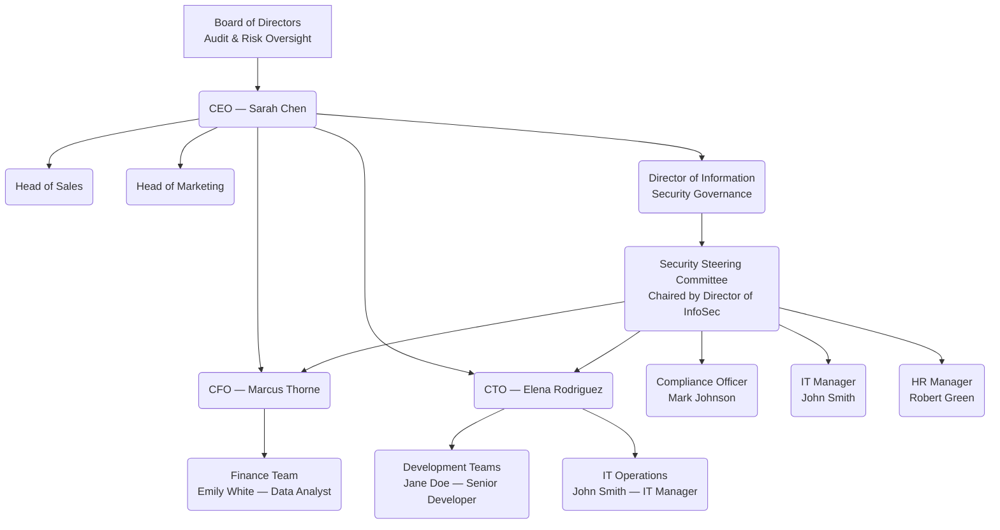

# Interactive Lab GRC102 — Week 5 Submission
**Course:** GRC102 - Information Security Governance
**Lab:** Lab 5 — Information Security Governance in Action
**Role:** Director of Information Security Governance, GlobalHealth Connect
**Submission Date:** March 5, 2026

---

# Table of Contents

1. [Task 1 — The Governance Blueprint](#task-1)
   - 1.1 Proposed Security Governance Organizational Chart
   - 1.2 RACI Matrix
2. [Task 2 — The Security Charter](#task-2)
   - 2.1 GHC Information Security Charter
   - 2.2 Justification Memo to Marcus Thorne (CFO)
3. [Task 3 — Board Reporting and Metrics](#task-3)
   - 3.1 Board Executive Summary
   - 3.2 Rationale for Metric Selection
4. [Task 4 — The Security Steering Committee](#task-4)
   - 4.1 SSC Terms of Reference
   - 4.2 Sample SSC Meeting Agenda
   - 4.3 Briefing Note to Sarah Chen (CEO)
5. [Task 5 — Governance Maturity Assessment](#task-5)
   - 5.1 Completed Maturity Assessment Table
   - 5.2 Maturity Roadmap
   - 5.3 Executive Summary of Assessment for David Miller (Board)

---

# Task 1 — The Governance Blueprint

## Deliverable 1.1 — Proposed Security Governance Organizational Chart

The revised structure formally establishes the Director of Information Security Governance as a senior leadership role with a direct reporting line to the CEO. This positioning reflects the strategic importance of the function and ensures independence from the technology and finance divisions. A Security Steering Committee (SSC) is introduced as a cross-functional advisory and decision-making body, chaired by the Director of InfoSec Governance, with representation from all major business units.

**Rationale for Structure:**

The Director of Information Security Governance reports directly to the CEO to ensure the security program has executive sponsorship and organizational authority. Placement outside the CTO's chain of command avoids the conflict of interest inherent in having the same function that drives innovation also police its security controls. The SSC bridges this gap by bringing the CTO, CFO, IT, HR, and Compliance into a shared governance body, ensuring that security decisions are made collaboratively rather than imposed unilaterally. The Board retains audit and risk oversight responsibility, consistent with its accountability to shareholders and regulators.

---

## Deliverable 1.2 — RACI Matrix

**Key Governance Activities Assessed:**
- **Activity A:** Information Security Policy Approval
- **Activity B:** Organizational Risk Assessment Review
- **Activity C:** Security Incident Response Planning

| Stakeholder | Activity A: Policy Approval | Activity B: Risk Assessment Review | Activity C: Incident Response Planning |
|---|---|---|---|
| **CEO (Sarah Chen)** | A | I | I |
| **CFO (Marcus Thorne)** | C | C | I |
| **CTO (Elena Rodriguez)** | C | C | C |
| **Director of InfoSec Governance** | R | R / A | R / A |
| **IT Manager (John Smith)** | C | R | R |
| **Compliance Officer (Mark Johnson)** | C | C | C |
| **HR Manager (Robert Green)** | I | I | C |
| **Senior Developer (Jane Doe)** | I | I | I |
| **Board of Directors** | I | A | I |

**Key:**
- **R — Responsible:** Does the work
- **A — Accountable:** Final authority; single owner per activity
- **C — Consulted:** Provides input before a decision is made
- **I — Informed:** Notified of outcomes; no action required

**Notes:**

For Policy Approval, the CEO holds accountability as the signatory authority, while the Director of InfoSec Governance leads the drafting and coordination. The CFO and CTO are consulted to ensure policies do not conflict with financial or operational constraints. For Risk Assessment Review, the Director of InfoSec Governance is both responsible and accountable, escalating significant findings to the Board. For Incident Response Planning, the IT Manager takes a Responsible role in executing technical response procedures, while the Director of InfoSec Governance owns the overall plan. HR is consulted given its role in insider threat scenarios and employee notification obligations.

---

# Task 2 — The Security Charter

## Deliverable 2.1 — GHC Information Security Charter

---

# GlobalHealth Connect Information Security Charter

**Document Classification:** Governance — Internal
**Version:** 1.0
**Effective Date:** March 5, 2026
**Approved By:** Sarah Chen, CEO, GlobalHealth Connect

---

## 1. Purpose

GlobalHealth Connect (GHC) operates at the intersection of healthcare delivery and digital technology, managing Protected Health Information (PHI) on behalf of over 500 clinics and healthcare providers across the United States and internationally. The trust placed in GHC by its clients, patients, and partners is the foundation of its business.

The purpose of this Information Security Charter is to formally establish the GHC Information Security Program (the "Program") and to define its mandate, authority, and guiding principles. This Charter provides the executive directive necessary to develop, implement, maintain, and enforce a risk-based information security governance framework across the entire organization. It ensures that information security is treated as a strategic business function — not an IT afterthought — and that it actively supports GHC's goals of market growth, regulatory compliance, customer trust, and operational excellence.

---

## 2. Scope

This Charter and the Information Security Program it establishes apply to:

- **All information assets** owned, processed, stored, or transmitted by GHC, including PHI, financial data, intellectual property, and operational data.
- **All GHC systems and infrastructure**, including cloud platforms, on-premise systems, corporate endpoints, and development environments.
- **All personnel**, including full-time employees, contractors, consultants, and third-party vendors with access to GHC systems or data.
- **All entities acquired by GHC**, including the two recently integrated startups, regardless of their legacy security posture.
- **All geographic locations** in which GHC operates or processes data, inclusive of jurisdictions subject to HIPAA, HITECH, GDPR, and applicable state-level health data regulations.

---

## 3. Authority

The Information Security Program is established under the direct authority of the Chief Executive Officer, Sarah Chen, with oversight provided by the GHC Board of Directors. The **Director of Information Security Governance** is hereby granted the following authority:

- To develop, publish, and enforce information security policies, standards, and procedures across all GHC departments.
- To conduct or commission risk assessments, audits, and security reviews of any GHC system, process, or third-party relationship.
- To escalate unresolved security risks or non-compliance matters directly to the CEO and, where appropriate, the Board of Directors.
- To chair the Security Steering Committee (SSC) and drive cross-functional alignment on security decisions.
- To engage external specialists, auditors, or legal counsel as required to fulfil the Program's mandate.

No department or individual may override or circumvent the requirements of the Information Security Program without documented, risk-accepted approval from the Director of Information Security Governance and the CEO.

---

## 4. Roles and Responsibilities

The governance structure for information security at GHC is defined in detail in the Security Governance Organizational Chart and RACI Matrix (Task 1). The following high-level responsibilities apply:

| Role | Responsibility |
|---|---|
| **Board of Directors** | Provides audit and risk oversight; receives quarterly security updates; approves risk appetite. |
| **CEO** | Sponsors the Program; approves this Charter; resolves executive-level escalations. |
| **CFO** | Approves security budgets; ensures financial risk from security threats is understood and managed. |
| **CTO** | Ensures security requirements are integrated into technology development and operations. |
| **Director of InfoSec Governance** | Owns and operates the Program; sets strategy; chairs the SSC; reports to the CEO and Board. |
| **IT Manager** | Implements technical security controls; maintains infrastructure security. |
| **Compliance Officer** | Ensures alignment between security practices and regulatory requirements (HIPAA, GDPR, HITECH). |
| **HR Manager** | Manages security obligations in the employee lifecycle — onboarding, training, and offboarding. |
| **All Staff** | Adhere to GHC security policies; report suspected incidents promptly. |

---

## 5. Key Principles

The GHC Information Security Program is guided by the following principles:

1. **Risk-Based Prioritisation:** Security investments and controls are proportionate to the risk they address. Not all risks are equal; resources are directed where they matter most.
2. **Business Alignment:** Security exists to enable GHC's business objectives, not to obstruct them. Every significant security decision considers its operational and commercial impact.
3. **Regulatory Compliance by Design:** Compliance with HIPAA, GDPR, HITECH, and equivalent regulations is embedded into processes and systems from the outset, not retrofitted.
4. **Accountability and Transparency:** Roles, responsibilities, and performance metrics are clearly defined and communicated. Leadership is given accurate, timely information to make informed risk decisions.
5. **Continuous Improvement:** The threat landscape evolves. GHC's security posture is regularly assessed and improved in response to new risks, incidents, and emerging best practices.
6. **Shared Ownership:** Information security is a responsibility shared across the organisation. The Director of InfoSec Governance leads the Program, but every employee is a participant.

---

## 6. Reporting Structure

The Director of Information Security Governance reports directly to the CEO and provides:

- **Monthly updates** to the CEO and the Security Steering Committee on operational security matters and emerging risks.
- **Quarterly reports** to the Board of Directors, presented in business-language metrics covering security posture, incident trends, compliance status, and programme maturity.
- **Ad hoc escalations** to the CEO and Board in the event of a high-impact security incident or material compliance breach.

---

## 7. Review and Approval

This Charter shall be reviewed **annually**, or sooner in the event of:
- A significant security incident or confirmed data breach.
- A material change in GHC's regulatory obligations.
- A strategic event such as an acquisition, merger, or significant expansion into new markets.

Review is led by the Director of Information Security Governance in consultation with the Compliance Officer, CFO, and CTO. Final approval requires the signature of the CEO. The Board of Directors is informed of any material updates.

---

**Effective Date:** March 5, 2026
**Approved By:** Sarah Chen, CEO, GlobalHealth Connect
**Next Scheduled Review:** March 2027

---

## Deliverable 2.2 — Justification Memo to Marcus Thorne (CFO)

---

**MEMORANDUM**

**To:** Marcus Thorne, Chief Financial Officer
**From:** Director of Information Security Governance
**Date:** March 5, 2026
**Subject:** Information Security Charter — Strategic Alignment and Business Case

---

The proposed Information Security Charter provides the formal mandate you and the Board requested — a clear, documented directive that establishes the authority of the security program, assigns accountability across the organisation, and defines the boundaries of the program's scope. Rather than a blanket spending commitment, the Charter establishes a risk-based framework in which every security investment is evaluated against the business risk it mitigates. This directly addresses your concern about accountability: the Director of Information Security Governance is the named, single point of ownership for the program, with a defined reporting line to the CEO and quarterly disclosure obligations to the Board.

From a financial risk perspective, the Charter aligns explicitly with three of GHC's five 2026 strategic goals. Goal 3 (customer trust) and Goal 5 (regulatory excellence) are directly protected by a governed security program — a HIPAA or GDPR breach would expose GHC to regulatory fines, remediation costs, and reputational damage that far outweigh the cost of governance. Goal 2 (operational efficiency) is supported by moving away from the current ad-hoc, reactive posture, which carries hidden costs in incident response, unplanned downtime, and compliance scrambles. The Charter is not a cost centre directive; it is a risk management instrument that protects GHC's revenue, client relationships, and market position.

---

# Task 3 — Board Reporting and Metrics

## Deliverable 3.1 — Board Executive Summary

---

# Information Security Report — Board of Directors

**Reporting Period:** September 2025 – February 2026
**Prepared By:** Director of Information Security Governance, GlobalHealth Connect
**Date:** March 5, 2026

---

## 1. Overall Security Posture: 🔴 RED

GHC's security posture for the period September 2025 to February 2026 is assessed as **RED**. Across all six months reviewed, the volume of threats directed at the organisation has increased materially and consistently. More critically, the organisation's ability to defend against those threats — as measured by patching compliance and unresolved critical vulnerabilities — has declined. The number of high-risk incidents has risen every single month, reaching seven in February 2026. While security awareness training completion has improved, it has not yet translated into a reduction in threat impact. The programme is currently operating in a reactive posture, and without intervention, the risk of a material data breach affecting Protected Health Information is escalating.

---

## 2. Key Security Metrics

| Metric | February 2026 Status | 6-Month Trend | Commentary |
|---|---|---|---|
| **High-Risk Security Incidents** | 7 incidents | ⬆ Increasing (from 2 in Sept) | Each high-risk incident represents a potential pathway to a reportable breach. A 250% increase in six months is the single most urgent indicator of deteriorating security posture. |
| **Critical Vulnerability Patching Compliance** | 55% (22 of 40 patched) | ⬇ Declining (from 67% in Sept) | Less than 6 in 10 critical vulnerabilities are being remediated on time. Unpatched systems in a healthcare environment represent direct exposure to HIPAA enforcement risk and ransomware attack vectors. |
| **Unpatched Critical Vulnerabilities** | 18 open (cumulative Feb) | ⬆ Backlog growing | The absolute number of unpatched critical vulnerabilities is growing faster than the team can remediate them. This backlog represents tangible, quantifiable risk exposure. |
| **Phishing Attempts Detected** | 320 attempts | ⬆ Increasing (from 150 in Sept) | Phishing is the leading entry point for healthcare data breaches. A 113% increase in detected attempts indicates GHC is an active target. Staff remain the most exposed layer of defence. |
| **Security Awareness Training Completion** | 70% of staff | ⬆ Improving (from 45% in Sept) | The one positive trend in this period. Training completion is approaching an acceptable baseline, though 30% of staff remain untrained — a material gap given the phishing volume observed. |

---

## 3. Key Risks and Issues

- **Risk 1 — Rising Incident Frequency:** High-risk incidents have increased every month without exception. At the current trajectory, a high-impact incident causing a reportable breach under HIPAA or GDPR is a credible near-term risk, not a theoretical one. The consequences include regulatory fines up to $1.9M per HIPAA violation category and significant reputational damage.

- **Risk 2 — Deteriorating Patch Posture:** Patching compliance has fallen from 67% to 55% over six months. The gap between vulnerabilities identified and vulnerabilities remediated is widening. Critical vulnerabilities that remain unpatched beyond vendor-recommended timeframes create exploitable windows that threat actors are known to target, particularly in healthcare infrastructure.

---

## 4. Recommendations

- **Recommendation 1 — Establish a Formal Vulnerability Management Programme:** Implement a tracked, time-bound patching process with escalation triggers for critical vulnerabilities unresolved beyond 14 days. Set a minimum patching compliance target of 90% for critical vulnerabilities, reported monthly to the SSC and quarterly to the Board.

- **Recommendation 2 — Mandate Role-Based Security Awareness Training:** Move from an annual checkbox exercise to a quarterly, role-targeted training programme with phishing simulation exercises. Require 100% completion as a staff compliance obligation. This directly addresses the primary attack vector — phishing — that is driving the incident trend.

---

## Deliverable 3.2 — Rationale for Metric Selection

The five metrics selected — High-Risk Incidents, Critical Vulnerability Patching Compliance, Unpatched Critical Vulnerabilities, Phishing Attempts, and Security Awareness Training Completion — were chosen because together they tell a complete and honest story about GHC's security posture from a business risk perspective. High-risk incidents and unpatched vulnerabilities represent outcome and exposure metrics: they directly correlate to the likelihood and potential severity of a breach. Patching compliance is a leading control-effectiveness metric: it reveals whether GHC's defences are holding or weakening over time. Phishing attempts provide context for the threat environment GHC is operating in — it is not a static background noise figure, it is rising. Finally, training completion is the one forward-looking positive signal in the data, included deliberately to show the Board that improvement is possible and that investment in awareness is beginning to yield results. Collectively, these metrics allow a non-technical Board member to answer the fundamental question: are we getting more or less secure, and what are the primary factors driving that direction?

---

# Task 4 — The Security Steering Committee

## Deliverable 4.1 — SSC Terms of Reference

---

# GlobalHealth Connect Security Steering Committee (SSC)
# Terms of Reference

**Document Classification:** Governance — Internal
**Version:** 1.0
**Effective Date:** March 5, 2026
**Approved By:** Sarah Chen, CEO

---

## 1. Purpose

The GlobalHealth Connect Security Steering Committee (SSC) is established as the primary cross-functional governance body responsible for providing strategic direction, resolving cross-departmental conflicts, and ensuring organisational alignment on information security matters. The SSC exists to ensure that security decisions are made collaboratively, with full consideration of business operations, regulatory requirements, and risk appetite — and that they are not made in isolation by any single department.

The SSC operates under the authority of the CEO and reports its activities to the Board of Directors on a quarterly basis. It serves as the primary mechanism for translating GHC's security strategy into actionable, business-aligned decisions.

---

## 2. Scope

The SSC has oversight and decision-making authority over the following areas:

- Approval and periodic review of enterprise-wide information security policies and standards.
- Prioritisation and resource allocation for significant security initiatives and investments.
- Review and acceptance of material security risks escalated by the Director of Information Security Governance.
- Resolution of cross-departmental conflicts arising from security requirements and business operations.
- Review of security incidents with organisational impact and oversight of remediation progress.
- Evaluation of security implications for major business decisions, including acquisitions, new product launches, and entry into new regulatory jurisdictions.

---

## 3. Membership

The SSC shall comprise the following standing members:

| Member | Role | Representation |
|---|---|---|
| Director of Information Security Governance | **Chair** | Security Programme |
| CEO (or designated delegate) | Member | Executive Leadership |
| CFO | Member | Financial Risk & Compliance |
| CTO | Member | Technology & Development |
| IT Manager | Member | IT Operations & Infrastructure |
| Compliance Officer | Member | Regulatory & Legal |
| HR Manager | Member | People & Culture |

The Chair may invite subject matter experts or project leads to attend specific agenda items as non-voting participants. Membership is reviewed annually.

---

## 4. Roles and Responsibilities of Members

- **Chair (Director of InfoSec Governance):** Sets and circulates the agenda at least five business days prior to each meeting; facilitates discussions; ensures decisions are documented and actioned; escalates unresolved matters to the CEO.
- **All Members:** Attend scheduled meetings or send a designated alternate; review pre-circulated materials prior to meetings; represent their department's perspective and constraints; own and complete assigned action items within agreed timeframes; maintain confidentiality of SSC discussions.
- **CEO Delegate:** Ensures executive visibility of SSC decisions; provides authorisation for actions requiring CEO-level approval where the CEO is not present.

---

## 5. Meeting Cadence and Logistics

- **Regular Meetings:** Monthly, with a standard duration of 90 minutes.
- **Ad Hoc Sessions:** Convened within 48 hours of a high-impact security incident or urgent cross-departmental conflict, at the discretion of the Chair.
- **Quorum:** A minimum of five members must be present for decisions to be binding.
- **Minutes:** Recorded by a designated secretary (appointed from the Information Security team); distributed to all members within five business days of each meeting; retained as governance records for a minimum of three years.
- **Meeting Format:** In-person or virtual; location confirmed with each agenda distribution.

---

## 6. Decision-Making Authority

The SSC is empowered to:

- Approve or reject information security policies and standards on behalf of the organisation.
- Accept, transfer, mitigate, or escalate security risks within GHC's defined risk appetite.
- Resolve cross-departmental disputes relating to security requirements by issuing a binding decision, documented in the minutes.

Where a decision requires expenditure above the pre-approved security budget threshold, the SSC will prepare a recommendation for CEO approval. Where a decision involves a material change to GHC's risk posture, the SSC will escalate to the Board. In the event of a deadlock among members, the Chair holds the casting vote.

---

## 7. Reporting

- The Chair will prepare a **quarterly summary report** of SSC activities, decisions, and open risks for presentation to the CEO and the Board of Directors.
- Significant decisions or material risk acceptances will be communicated to the Board outside of the regular cycle where urgency demands it.
- Meeting minutes are made available to the CEO and any auditor or regulator with a legitimate request.

---

## Deliverable 4.2 — Sample SSC Meeting Agenda

---

# GlobalHealth Connect Security Steering Committee
# Meeting Agenda — Inaugural Session

**Date:** March 19, 2026
**Time:** 10:00 AM – 11:30 AM
**Location:** GHC Boardroom / Virtual (Teams Link Distributed Separately)
**Chair:** Director of Information Security Governance
**Attendees:** Sarah Chen (CEO), Marcus Thorne (CFO), Elena Rodriguez (CTO), John Smith (IT Manager), Mark Johnson (Compliance Officer), Robert Green (HR Manager)

*Pre-Reading: Agenda and supporting documents circulated by March 14, 2026.*

---

### 1. Welcome and Purpose of the SSC *(10 minutes)*
- Chair opens the inaugural session and confirms quorum.
- Brief overview of the SSC's mandate, authority, and operating principles as established in the Terms of Reference.
- Confirmation of meeting logistics, minutes process, and action item tracking.

---

### 2. Review and Approval of Terms of Reference *(10 minutes)*
- Members review the SSC Terms of Reference (pre-circulated).
- Discussion of any amendments.
- Formal adoption by the Committee.

---

### 3. Action Items from Prior Governance Work *(5 minutes)*
- No prior meeting actions. Standing item for future sessions.
- Chair notes outstanding follow-up from the governance structure and charter work completed in March 2026.

---

### 4. Security Posture Update *(15 minutes)*
- Chair presents key highlights from the Board Executive Summary (September 2025 – February 2026).
- Focus on: rising incident trend, declining patching compliance, phishing volume.
- No detailed discussion at this stage — full risk register review in Item 6.

---

### 5. Key Discussion Items *(30 minutes)*

**5a. Proposed Password Policy — Resolution of Cross-Departmental Conflict** *(20 minutes)*

*Background:* IT Manager (John Smith) has proposed a mandatory 16-character complex password policy with 30-day rotation and no password manager integration. CTO (Elena Rodriguez) has raised a formal objection on grounds of developer productivity and shadow IT risk.

*Discussion Goal:* Reach an SSC-endorsed resolution that addresses both the security imperative and the operational concern.

*Pre-Circulated Compromise Proposal for Discussion:*
- Minimum 14-character passwords (meets NIST SP 800-63B guidance).
- Mandatory Multi-Factor Authentication (MFA) for all systems.
- Approved password manager tooling provided to all staff.
- Password rotation triggered by suspected compromise, not on a fixed calendar cycle.

*Action Required:* SSC to discuss, amend if needed, and adopt a binding resolution. Decision to be documented in minutes and communicated to all staff.

**5b. Vulnerability Management — Response to Declining Patching Compliance** *(10 minutes)*
- IT Manager to brief the SSC on current patching capacity constraints.
- Discussion of a proposed 14-day SLA for critical vulnerability remediation.
- Action Required: SSC to agree on a target compliance rate and reporting mechanism.

---

### 6. Risk Register Review *(15 minutes)*
- Chair presents the top five organisational security risks.
- Members confirm risk owners and review mitigation status.
- Any risks requiring escalation to the CEO or Board are flagged.

---

### 7. New Business / Open Forum *(5 minutes)*
- Members may raise any security-related matters not on the agenda.

---

### 8. Action Items and Next Steps *(5 minutes)*
- Chair confirms all decisions made and action items assigned.
- Owners and deadlines confirmed for each action item.
- Next meeting scheduled: April 16, 2026.

---

### 9. Adjournment

---

## Deliverable 4.3 — Briefing Note to Sarah Chen (CEO)

---

**BRIEFING NOTE**

**To:** Sarah Chen, Chief Executive Officer
**From:** Director of Information Security Governance
**Date:** March 5, 2026
**Subject:** Security Steering Committee — Purpose and Resolution of the Password Policy Conflict

---

The Security Steering Committee has been established to provide exactly the structured, cross-functional forum that situations like the current password policy dispute require. Rather than escalating security disagreements to the CEO or resolving them through informal negotiation between departments, the SSC gives every major stakeholder — technology, finance, compliance, HR — a formal seat at the table, with a defined process for reaching binding decisions. The password policy conflict between the CTO and IT Manager is a straightforward example of a business-versus-security trade-off that neither party can resolve unilaterally. The SSC's role is to weigh both perspectives against GHC's risk appetite and regulatory obligations, and to issue a decision that the entire organisation can act on with confidence. This prevents the issue from becoming a prolonged bilateral dispute and ensures the outcome is documented, accountable, and enforceable.

More broadly, the SSC addresses a structural gap that has contributed to GHC's ad-hoc security posture: the absence of a formal mechanism for aligning security strategy with business operations. With the SSC in place, security decisions are no longer handed down from IT and accepted or rejected informally by other departments. They are developed collaboratively, with the Director of Information Security Governance providing security leadership and each functional head providing operational context. This approach directly supports your strategic goal of making security a business enabler — not a constraint — and ensures that the Board can hold a defined, cross-functional body accountable for the organisation's security direction.

---

# Task 5 — Governance Maturity Assessment

## Deliverable 5.1 — Completed Maturity Assessment Table

*Scoring based on the Simplified Maturity Model (1 = Ad Hoc, 5 = Optimising) and GHC Current State Interview Summary.*

| Governance Domain | Current Maturity Score | Justification |
|---|---|---|
| **Policy & Documentation** | **2 — Initial** | GHC has policies in place, primarily inherited from acquired companies. However, the IT Manager acknowledges they are inconsistent and not kept current. Policies exist but are not standardised, reviewed, or systematically communicated across the organisation. |
| **Roles & Responsibilities** | **1 — Ad Hoc** | The HR Manager confirmed that security ownership is unclear across the organisation. While individuals such as John Smith perform security-related tasks, there are no formally documented role definitions or accountability assignments for information security. Responsibility is assumed rather than assigned. |
| **Risk Management** | **1 — Ad Hoc** | The CFO acknowledged that GHC's approach to risk is entirely reactive — the organisation responds to incidents rather than conducting proactive, structured risk assessments. There is no evidence of a defined risk assessment methodology, risk register, or formal risk acceptance process. |
| **Metrics & Reporting** | **2 — Initial** | Technical metrics are being tracked at the operational level, as confirmed by the previous Director of InfoSec Governance. However, there is no capability to translate these metrics into business-language reporting for executive or Board audiences. Reporting is inconsistent and not tied to risk appetite or strategic objectives. |
| **Training & Awareness** | **2 — Initial** | Mandatory annual security training is in place, satisfying a basic compliance checkbox. However, the HR Manager noted low engagement and a lack of programme effectiveness. Training is not role-based, not reinforced through simulations, and not measured beyond completion rates. |
| **Compliance** | **2 — Initial** | The Compliance Officer confirmed that GHC prepares reactively for audits rather than maintaining continuous compliance. While compliance activities occur, they are episodic and not embedded into operational processes. Continuous monitoring and evidence collection are not yet established practices. |

**Overall Average Maturity Score: 1.67 — between Ad Hoc and Initial**

---

## Deliverable 5.2 — Maturity Roadmap

**Target:** Level 3 (Defined) across all governance domains within 12–18 months.

---

### Initiative 1 — Develop and Approve a Unified Information Security Policy Suite

**Objective:** Replace the current patchwork of inherited, inconsistent policies with a single, coherent policy framework tailored to GHC's regulatory environment and business context.

**Key Activities:**
- Inventory all existing policies from GHC and acquired companies.
- Identify gaps against HIPAA, GDPR, and ISO 27001 requirements.
- Draft a consolidated policy suite covering: acceptable use, data classification, access control, incident response, and third-party risk.
- Obtain formal approval through the SSC and CEO.
- Communicate policies to all staff through a managed rollout with acknowledgement tracking.

**Expected Outcome:** All staff operate under a single, approved, and current policy framework. Policies are version-controlled, accessible, and reviewed on a defined annual cycle. Moves Policy & Documentation from Level 2 to Level 3.

**Target Completion:** Month 1–4

---

### Initiative 2 — Formalise Security Roles and Accountability Across the Organisation

**Objective:** Eliminate ambiguity around who owns what in information security by embedding security responsibilities into job descriptions and team charters.

**Key Activities:**
- Update job descriptions for all roles with defined security responsibilities (starting with IT, Development, Compliance, and HR).
- Formalise the RACI matrix developed in Task 1 and distribute it organisation-wide.
- Establish data owner designations for all major data classifications.
- Incorporate security responsibilities into the employee onboarding process managed by HR.

**Expected Outcome:** Every employee with a material security responsibility has it documented in their role. Accountability is unambiguous and enforceable. Moves Roles & Responsibilities from Level 1 to Level 3.

**Target Completion:** Month 2–5

---

### Initiative 3 — Implement a Structured Quarterly Risk Assessment Process

**Objective:** Transition GHC from a reactive, incident-driven posture to a proactive risk management approach, with a live risk register maintained throughout the year.

**Key Activities:**
- Adopt a risk assessment methodology aligned with NIST SP 800-30 or ISO 27005.
- Conduct an initial enterprise-wide risk assessment to populate a baseline risk register.
- Establish a quarterly risk review cycle, chaired by the Director of InfoSec Governance and reviewed by the SSC.
- Define GHC's risk appetite and risk acceptance criteria, approved by the CEO and Board.
- Integrate risk register outputs into quarterly Board reporting.

**Expected Outcome:** GHC has a documented, maintained risk register. Risks are assessed proactively, assigned to owners, and tracked to resolution. Moves Risk Management from Level 1 to Level 3.

**Target Completion:** Month 3–7

---

### Initiative 4 — Build a Security Metrics Dashboard with Business-Language KPIs

**Objective:** Establish a consistent, Board-ready reporting cadence that translates operational security data into business risk language, enabling informed executive decision-making.

**Key Activities:**
- Define a core set of 8–10 KPIs covering threat volume, control effectiveness, compliance posture, and incident trends.
- Implement a dashboard (tooling TBD based on existing infrastructure) that aggregates data from patch management, SIEM, and training platforms.
- Establish a monthly metrics review for the SSC and a quarterly executive report for the Board.
- Set target thresholds and RAG status criteria for each metric.

**Expected Outcome:** GHC has a repeatable, data-driven reporting process. The Board receives consistent, comparable security updates at every quarterly meeting. Moves Metrics & Reporting from Level 2 to Level 3.

**Target Completion:** Month 4–8

---

### Initiative 5 — Redesign the Security Awareness Programme with Role-Based Training and Phishing Simulations

**Objective:** Replace the current annual compliance-checkbox training with an engaging, role-relevant programme that demonstrably reduces human-factor risk.

**Key Activities:**
- Segment staff into training cohorts by role and risk profile (e.g., developers, finance, clinical support staff).
- Develop or procure role-specific training content covering phishing, data handling, and access hygiene.
- Introduce quarterly phishing simulation exercises with tracked click-through and reporting rates.
- Integrate training completion and simulation performance into the security metrics dashboard.
- Coordinate with HR to embed refresher training into the annual performance cycle.

**Expected Outcome:** Training completion reaches 100%; phishing simulation click-through rates decline measurably over 12 months. Training is no longer a checkbox — it is a measured risk control. Moves Training & Awareness and Compliance from Level 2 to Level 3.

**Target Completion:** Month 3–9

---

## Deliverable 5.3 — Executive Summary of Assessment for David Miller (Board)

---

**EXECUTIVE SUMMARY — SECURITY GOVERNANCE MATURITY ASSESSMENT**

**Prepared For:** David Miller, Board Member, Audit & Risk Oversight
**Prepared By:** Director of Information Security Governance
**Date:** March 5, 2026

---

A formal assessment of GHC's security governance maturity — conducted using a five-level model aligned with NIST CSF and ISO 27001 principles — reveals that the organisation currently operates between Level 1 (Ad Hoc) and Level 2 (Initial) across all six governance domains assessed: Policy & Documentation, Roles & Responsibilities, Risk Management, Metrics & Reporting, Training & Awareness, and Compliance. In practical terms, this means that while some security activities are taking place, they are largely informal, inconsistently applied, and not yet embedded into GHC's operational processes. Risk management is reactive, policy ownership is unclear, and the organisation does not yet have the continuous compliance monitoring expected of a regulated healthcare data processor. This assessment is consistent with the "ad-hoc" characterisation acknowledged by the Board, and it confirms that the maturity gap is real and measurable.

The proposed 12–18 month roadmap targets Level 3 (Defined) maturity across all domains through five structured initiatives: developing a unified policy framework, formalising security roles and accountability, establishing a quarterly risk assessment process, building a business-language metrics dashboard, and redesigning the security awareness programme. Reaching Level 3 is not an aspirational benchmark — it is the minimum standard expected of a HIPAA-regulated organisation processing PHI at GHC's scale. At Level 3, GHC will have documented, repeatable, and communicated processes in place across every governance domain, providing the Board with the accountability, transparency, and measurable performance indicators necessary to exercise effective risk oversight. The roadmap is sequenced to deliver foundational improvements first, with each initiative building on the last, and progress will be reported to the Board on a quarterly basis.

---

*End of Submission*

---

**Document:** Interactive_Lab_GRC102_W5_Submission
**Course:** GRC102 — Information Security Governance
**Institution:** [Your Institution]
**Submission Date:** March 5, 2026
